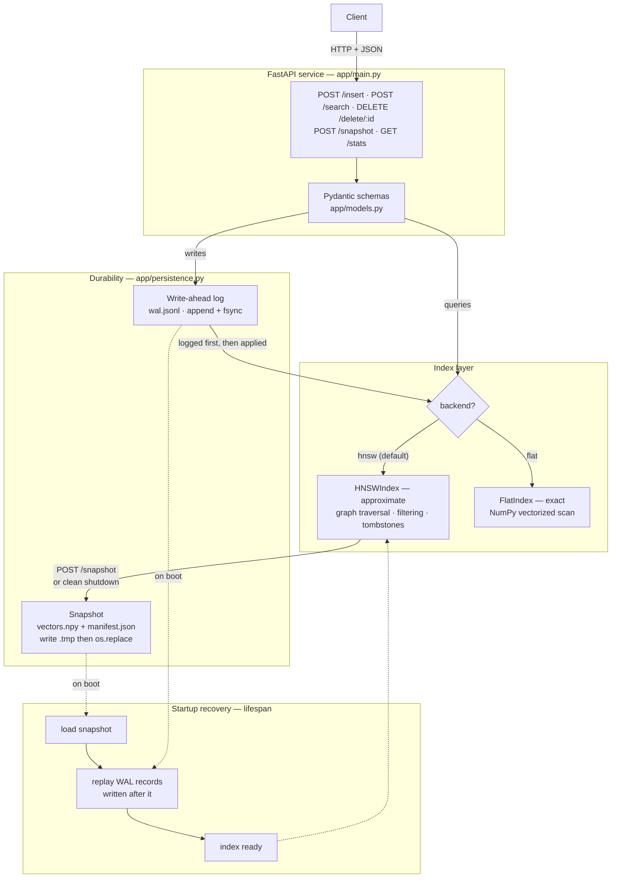
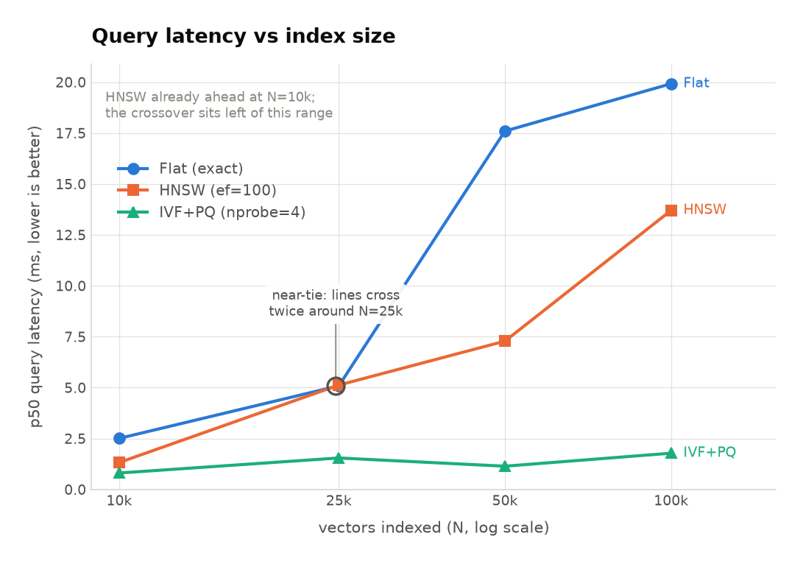
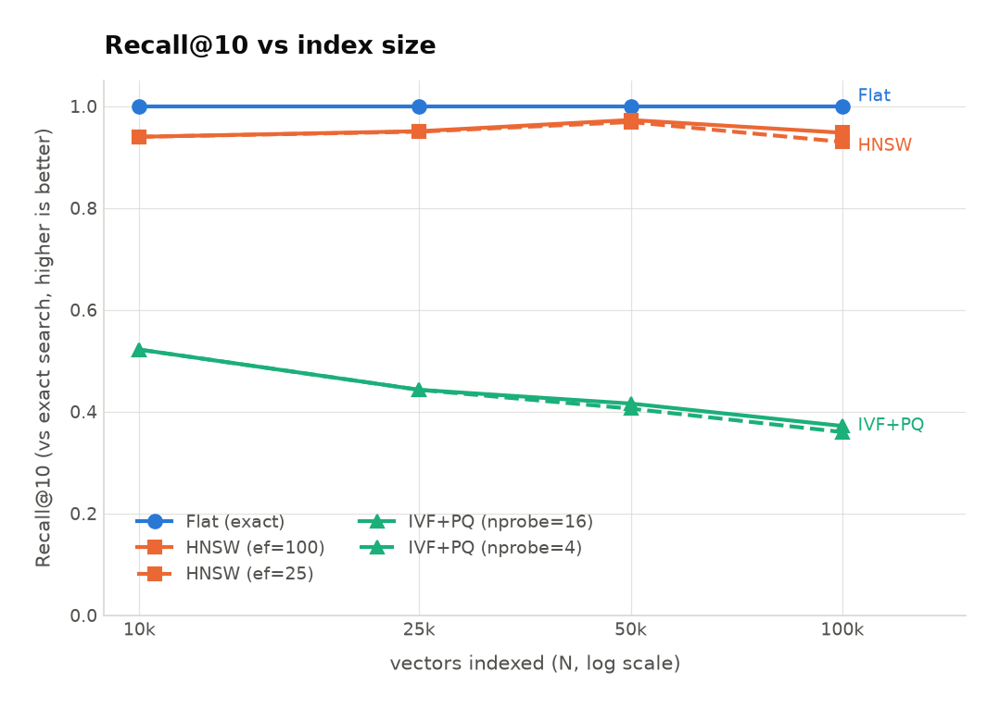
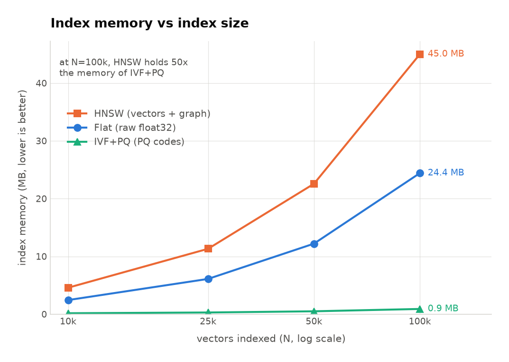

# nanovec


A persistent, filterable vector database built from scratch in Python: two
independent approximate indexes — an HNSW graph and an IVF + Product
Quantization index — plus metadata filtering, tombstone deletes, a write-ahead
log and snapshot durability layer, and a brute-force exact index kept alongside
as ground truth, all behind a FastAPI service.

The two approximate indexes are deliberate: HNSW trades build time for query
speed at full precision, IVF+PQ trades accuracy for a 32× smaller footprint.
They fail for different reasons, which is the point of implementing both.

## Why

I wanted to understand what FAISS, Milvus and Pinecone are actually doing, so
this implements the internals rather than calling a library. Everything here is
written from the papers and from first principles: the HNSW layer structure, the
Algorithm 4 diversity heuristic, the undirected-edge maintenance that keeps the
graph navigable, and the WAL-before-apply ordering that makes an acknowledged
write survive a crash.

The exact index runs in parallel with the approximate one, so recall is measured
against ground truth rather than assumed. The interesting output of a project
like this is not the code — it's the diagnostics. See
[Engineering notes](#engineering-notes).

## Current capabilities

- **`HNSWIndex`** (`app/hnsw.py`) — multi-layer navigable small world graph:
  skip-list style level assignment, greedy descent through sparse upper layers,
  wide `ef` search at layer 0, neighbour selection via the paper's diversity
  heuristic with `keepPrunedConnections` top-up, and undirected edge maintenance
  during pruning.
- **`IVFPQIndex`** (`app/ivfpq.py`) — inverted file index with product
  quantization: k-means++ coarse quantizer partitioning the space into `nlist`
  Voronoi cells, residual product quantization (`m` subspaces, one 256-entry
  codebook each), and asymmetric distance computation via per-cell `m × 256`
  lookup tables. Supports metadata filtering and tombstone deletes, and reports
  its own memory accounting split into per-vector and fixed costs.
- **Metadata filtering** — `pre` (filter during traversal) and `post` (filter
  after search), exposing the real filtered-ANN trade-off.
- **Tombstone deletes** — deleted nodes stay in the graph so traversal through
  them still works.
- **Durability** (`app/persistence.py`) — fsync'd write-ahead log, atomic
  snapshots, and recovery by snapshot load plus WAL replay.
- **`FlatIndex`** (`app/index.py`) — brute-force exact search, cosine and L2,
  NumPy-vectorized. The correctness ground truth, and reachable at runtime for
  exact-vs-approximate comparison over identical data.
- **FastAPI service** (`app/main.py`) — five endpoints, HNSW as the default
  query backend, index recovered from disk on startup via lifespan.
- **43 tests** covering recall against the flat baseline, graph edge symmetry,
  filtering semantics, delete behaviour, persistence including torn-record and
  idempotent-replay cases, and IVF+PQ recall, compression and memory accounting.
- **Diagnostics** — an ef/recall/latency sweep, a graph connectivity checker, a
  three-way index comparison, and a PQ compression/recall trade-off sweep.

## Architecture



**Write path:** the request is validated, appended to the WAL and fsync'd, and
only then applied to the in-memory index. **Recovery path:** load the latest
snapshot, then replay the WAL records that came after it.

**Search path through HNSW:** enter at the top layer, greedily walk to the
closest node at each level with `ef=1`, then run a wide best-first search at
layer 0 with the caller's `ef` budget and return the top `k`.

## Quickstart

### Docker (recommended)

```bash
git clone https://github.com/PPaul14/nanovec.git
cd nanovec
docker compose up --build
```

Interactive API docs: <http://localhost:8000/docs>

State persists in the `nanovec-data` Docker volume, which survives
`docker compose down`. Removing it is a deliberate act — `docker compose down -v`.

**Deployment requirement: exactly one worker.** The compose file and Dockerfile
both pin `--workers 1`, and that is a correctness constraint rather than a
performance default. The index is plain unsynchronised Python objects held in
process memory; a second uvicorn worker is a separate OS process with its own
divergent copy of the graph. Writes to one would be invisible to the other, and
each would snapshot over the other's state. Raising the worker count does not
scale nanovec, it corrupts it. Real concurrency would need either a lock plus
shared memory, or a single dedicated writer process.

### Local Python

```bash
git clone https://github.com/PPaul14/nanovec.git
cd nanovec

python -m venv venv
venv\Scripts\activate          # Windows
# source venv/bin/activate     # macOS / Linux

pip install -r requirements.txt
uvicorn app.main:app --reload
```

Interactive API docs: <http://127.0.0.1:8000/docs>

Run the tests and diagnostics:

```bash
venv/Scripts/python.exe -m pytest tests/ -v
venv/Scripts/python.exe -m benchmarks.ef_curve          # HNSW recall vs ef
venv/Scripts/python.exe -m benchmarks.connectivity      # HNSW graph health
venv/Scripts/python.exe -m benchmarks.compare_indexes   # Flat vs HNSW vs IVF+PQ
venv/Scripts/python.exe -m benchmarks.pq_tradeoff       # PQ recall vs compression
```

State persists to `data/` (`vectors.npy`, `manifest.json`, `wal.jsonl`).

## API reference

The service is configured for `DIM = 128`; vectors are abbreviated in the
examples below.

### `POST /insert`

```json
{
  "id": "doc_1",
  "vector": [0.12, -0.44, 0.98],
  "metadata": { "category": "shoes", "in_stock": true }
}
```

```json
{ "status": "ok", "id": "doc_1", "detail": null }
```

`400` if the vector dimension is not 128. `409` if the id already exists and is
not tombstoned. The record is written to the WAL and fsync'd before it is
applied in memory.

### `POST /search`

| Field | Type | Default | Meaning |
|---|---|---|---|
| `vector` | `float[128]` | required | Query vector |
| `k` | `int ≥ 1` | `5` | Number of results |
| `metric` | `string` | `"cosine"` | `"cosine"` or `"l2"` (flat backend) |
| `backend` | `"hnsw"` \| `"flat"` | `"hnsw"` | Approximate graph search, or exact scan |
| `ef` | `int ≥ 1` \| `null` | `null` | HNSW search breadth; `null` uses the index default |
| `filter` | `object` \| `null` | `null` | Exact-match metadata filter, conjunctive across keys |
| `filter_mode` | `"pre"` \| `"post"` | `"pre"` | Filter during traversal, or after search |

```json
{
  "vector": [0.10, -0.40, 0.95],
  "k": 3,
  "backend": "hnsw",
  "ef": 100,
  "filter": { "category": "shoes", "in_stock": true },
  "filter_mode": "pre"
}
```

```json
[
  { "id": "doc_1", "score": 0.9812, "metadata": { "category": "shoes", "in_stock": true } },
  { "id": "doc_7", "score": 0.9433, "metadata": { "category": "shoes", "in_stock": true } },
  { "id": "doc_3", "score": 0.9120, "metadata": { "category": "shoes", "in_stock": true } }
]
```

`score` is cosine similarity for `cosine` (higher is closer) and L2 distance for
`l2` (lower is closer). Tombstoned ids never appear. With `filter_mode: "post"`
the array may contain fewer than `k` entries — see [Filtering](#filtering).

### `DELETE /delete/{id}`

```json
{ "status": "ok", "id": "doc_1", "detail": null }
```

`404` if the id is unknown or already tombstoned. This is a soft delete: the
node remains in the graph as a traversal waypoint and is excluded from results.

### `POST /snapshot`

```json
{ "status": "ok", "id": null, "detail": "snapshot written to data" }
```

Writes a full point-in-time snapshot, then truncates the WAL. The snapshot is
made durable *before* the log is dropped.

### `GET /stats`

```json
{
  "live_vectors": 42,
  "tombstoned": 3,
  "dim": 128,
  "max_level": 2,
  "entry_point": "doc_17",
  "wal_bytes": 10432
}
```

## Durability

The index lives entirely in RAM, and rebuilding the graph from scratch is
expensive — every insert runs a full `ef_construction` search. So state is made
durable two ways, the same shape as Postgres checkpoints + WAL or Redis RDB +
AOF.

### Write-ahead log

Every mutation is appended to `data/wal.jsonl` and **fsync'd before it is
applied in memory**. The ordering is the entire guarantee. Apply-then-log would
leave a window where the client has been told the write succeeded but a crash
erases it; log-then-apply means the worst case is a logged record that was never
applied, which replay fixes.

The fsync matters as much as the ordering. Without it the write sits in the OS
page cache and a power loss silently drops it — that would be a write-behind log
that usually works, not a WAL.

### Snapshots

`save_snapshot` dumps the whole index: vectors as `vectors.npy` (float32 binary,
roughly 5× smaller than JSON and free of decimal round-tripping), and the graph,
metadata, levels and tombstones as `manifest.json` (human-readable, which makes
debugging connectivity far easier).

Both files are written to `.tmp` and then `os.replace`d, which is atomic on
POSIX and Windows. **A crash mid-write leaves the previous snapshot intact**
rather than a half-written unusable one.

### Recovery

On startup, `recover()` loads the latest snapshot and replays the WAL records
written after it. Two properties make this safe:

- **Replay is idempotent.** A snapshot may already contain a record the WAL also
  holds, so applying it twice must be harmless.
- **A torn final record stops replay cleanly.** A crash mid-append leaves an
  incomplete last line; that record never completed, so the client was never told
  it succeeded, and halting there is the correct behaviour rather than a
  corruption.

### Reproducing the crash test manually

Both tests below use a hard kill. **Do not use Ctrl+C** — a graceful shutdown
runs the lifespan handler, which takes a snapshot and truncates the WAL, and
that would defeat the second test entirely.

**Test 1 — snapshot survives a crash.**

```bash
uvicorn app.main:app                       # terminal 1

# terminal 2
curl -X POST localhost:8000/insert -H "Content-Type: application/json" \
     -d '{"id":"survivor","vector":[0.1, ... 128 floats]}'
curl -X POST localhost:8000/snapshot

# hard-kill the server (Windows; get the PID from netstat -ano | findstr :8000)
taskkill /F /PID <pid>
#   macOS / Linux: kill -9 <pid>

uvicorn app.main:app                       # restart
curl localhost:8000/stats                  # live_vectors includes "survivor"
```

**Test 2 — WAL replay recovers an unsnapshotted write.**

```bash
uvicorn app.main:app

curl -X POST localhost:8000/insert -H "Content-Type: application/json" \
     -d '{"id":"unsnapshotted","vector":[0.1, ... 128 floats]}'
# NO /snapshot call this time

taskkill /F /PID <pid>                     # hard kill again

uvicorn app.main:app
curl localhost:8000/stats                  # live_vectors still counts it
```

In test 2 the vector exists only in `data/wal.jsonl` at kill time. Recovery
replays it on top of whatever snapshot was on disk. The equivalent paths are
covered automatically by `tests/test_persistence.py`, including the torn-record
and idempotency cases.

### Durability across a destroyed container

The strongest version of the test: `docker compose down` removes the container
outright rather than stopping it, so recovery has to come off the volume into a
process that did not exist when the data was written.

```bash
docker compose up --build -d
curl http://localhost:8000/stats          # live_vectors: 0 on a fresh volume

# Insert one vector. Generate the 128 floats rather than typing them.
python -c "
import json, random, urllib.request
random.seed(6)
body = json.dumps({'id': 'durability-probe',
                   'vector': [round(random.uniform(-1, 1), 6) for _ in range(128)],
                   'metadata': {'test': 'week6'}}).encode()
req = urllib.request.Request('http://localhost:8000/insert', data=body,
                             headers={'Content-Type': 'application/json'})
print(urllib.request.urlopen(req).read().decode())
"

curl -X POST http://localhost:8000/snapshot
curl http://localhost:8000/stats          # live_vectors: 1, wal_bytes: 0

docker compose down                       # DESTROYS the container
docker volume ls | grep nanovec-data      # the volume is still there

docker compose up -d                      # a brand new container
curl http://localhost:8000/stats          # live_vectors: 1
```

Observed result:

```
before teardown: {"live_vectors":1,...,"entry_point":"durability-probe","wal_bytes":0}
container f0f705cf removed, volume vector-db_nanovec-data survived
after  recreate: {"live_vectors":1,...,"entry_point":"durability-probe","wal_bytes":0}
```

Searching the new container returns the vector with `score 1.0` and its metadata
intact, so it is not only the count that survived — the vector data, the
metadata and the graph entry point all came back off the volume.

`wal_bytes: 0` before teardown is the snapshot having truncated the log, which
is the ordering described above: the snapshot is durable before the WAL is
dropped.

## Running the tests / CI

```bash
pytest tests/ -v                    # 43 tests
python -m benchmarks.connectivity   # structural diagnostic
```

[GitHub Actions](.github/workflows/ci.yml) runs on every push and pull request:

- **`test`** — the full suite across Python **3.11, 3.12 and 3.13**, with
  `fail-fast: false` so one version failing does not cancel the others. Knowing
  whether a break is version-specific is the reason to run a matrix at all.
- **`docker`** — builds the image, starts the container, polls `/stats` until it
  answers (up to 30s), checks `/docs` renders, and tears down with
  `if: always()` so a failed run cannot leak a container.

The `test` job also runs the **connectivity diagnostic**, and that is the step
that matters most. Both real bugs in this project were invisible to the test
suite — the graph was fragmented, then later riddled with one-way edges, and
recall stayed high enough to pass every assertion both times. Asserting on
structural invariants in CI means a broken graph fails the build instead of
waiting to be noticed at a scale where it finally degrades recall.

## Filtering

Filtered ANN search has a genuine trade-off, and both sides of it are
implemented rather than one being picked silently.

**`filter_mode: "pre"`** applies the filter *during* graph traversal: a
non-matching node never enters the result set. It reliably returns `k` results
even under a highly selective filter, and costs more per query.

**`filter_mode: "post"`** searches normally, then drops non-matching results. It
is cheaper, but it can return fewer than `k` — or nothing at all.

The failure mode is concrete. Ask for the top 5 `"in_stock": true` items when
none of the 50 nearest neighbours are in stock: post-filtering searches, gets 50
out-of-stock neighbours, filters them all away, and returns an empty list even
though matching vectors exist further out. Pre-filtering keeps exploring until
it has 5 matches. (`post` oversamples to `max(ef, k * 10)` to make this less
likely, which shrinks the window without closing it.)

### Traversal must pass through non-matching nodes

The important implementation detail: under pre-filtering, the search still walks
*through* nodes that fail the filter. They are simply never admitted to the
result set.

Refusing to traverse them would be the obvious optimisation and it would be a
serious bug — it disconnects the graph along filter boundaries and reproduces
exactly the fragmentation failure from Week 2, where search gets stranded in
whichever region it started in. Non-matching nodes are still the bridges.

The early-termination check is also conditioned on the result set actually being
full, because under a selective filter it can stay below `ef` for a long stretch
and the search must keep exploring rather than bail out.

### Known cost

Filter matching is a full metadata scan, **O(N) per query**, on every filtered
search. Real systems maintain an inverted index (value → set of ids) to make
this sublinear. This is a known cost, not an oversight. Its impact is **not yet
measured** — neither benchmark exercises filtering.

## IVF + Product Quantization

HNSW attacks **time**: it avoids scanning all N vectors, but still stores every
vector at full precision. At 1M × 128-dim that is ~512 MB of raw float32 before
a single edge. IVF+PQ attacks **memory** instead, and the two techniques are
composed.

### IVF — scan fewer vectors

k-means partitions the space into `nlist` Voronoi cells. Every vector is
assigned to its nearest centroid and stored in that cell's inverted list. A
query computes its distance to the `nlist` centroids, then scans only the
`nprobe` nearest cells rather than all N vectors.

The coarse quantizer is trained with **k-means++** seeding. Uniform random
seeding lets two centroids land in the same cluster, and Lloyd's iterations
cannot recover — no centroid can cross the empty space between well-separated
clusters, so one ends up stranded midway between two real ones. Sampling each
new centroid with probability proportional to D(x)², the squared distance to the
nearest already-chosen centroid, biases selection toward whatever region is
currently covered worst.

### PQ — store each vector in m bytes

Split each `dim`-dimensional vector into `m` sub-vectors of length `dim/m`. Each
subspace gets its own 256-entry codebook, learned by k-means over that slice, so
a sub-vector is replaced by a single byte naming its nearest codebook entry. A
64-dim float32 vector — 256 bytes — becomes `m=8` bytes, a 32× reduction.

### Residual encoding

PQ encodes `vector - centroid`, not the vector itself. Residuals are far more
tightly distributed than raw vectors, so a fixed 256-entry codebook describes
them much more accurately. This is most of the gap between plain PQ and IVFADC,
and it is why the lookup tables have to be rebuilt per probed cell — the
residual is relative to *that* cell's centroid.

### Asymmetric Distance Computation

At query time the query is **never quantized**. For each subspace, precompute
the distance from the query's sub-vector to all 256 codebook entries, giving an
`m × 256` table. The distance to any stored vector is then `m` table lookups and
a sum — no decompression, no full-precision arithmetic.

Keeping one side exact is where "asymmetric" comes from, and it is measurably
more accurate than quantizing both sides, since it avoids adding the query's own
quantization error to every comparison.

### Why both indexes exist here

| | HNSW | IVF+PQ |
|---|---|---|
| Optimises | Query time | Memory |
| Storage | Full precision + graph | `m` bytes per vector |
| Loses recall by | Not visiting every node | Storing lossy reconstructions |
| Needs training | No | **Yes** — codebooks must be fitted first |

The two approximations are different in kind. HNSW can in principle reach recall
1.000 with a large enough `ef`, because the vectors it compares are exact; PQ
cannot, at any `nprobe`, because the information was discarded at encode time.
Their failure modes do not overlap, which is the whole reason to build both.

## Benchmarks

Measured on n=1000, dim=32, cosine, `M=16`, `M0=32`, `ef_construction=200`,
30 queries, Recall@10 against `FlatIndex` as ground truth. Single-threaded
CPython 3.14 on Windows. No filtering in these runs.

### Uniform random

| ef | Recall@10 | p50 (ms) | QPS |
|----:|----:|----:|----:|
| 10 | 1.000 | 1.351 | 714.9 |
| 25 | 1.000 | 2.200 | 472.2 |
| 50 | 1.000 | 2.903 | 282.9 |
| 100 | 1.000 | 3.620 | 257.5 |
| 200 | 1.000 | 5.608 | 159.0 |
| 400 | 1.000 | 5.935 | 152.6 |
| **flat (exact)** | **1.000** | **0.080** | **11385.8** |

### Clustered (sigma = 0.05, 10 clusters × 100)

| ef | Recall@10 | p50 (ms) | QPS |
|----:|----:|----:|----:|
| 10 | 1.000 | 0.511 | 1678.9 |
| 25 | 1.000 | 0.591 | 1369.1 |
| 50 | 1.000 | 0.644 | 1142.7 |
| 100 | 1.000 | 0.799 | 1195.4 |
| 200 | 1.000 | 1.437 | 608.8 |
| 400 | 1.000 | 2.568 | 374.1 |
| **flat (exact)** | **1.000** | **0.072** | **12865.3** |

### Graph connectivity (clustered, n=1000)

| Metric | Value |
|---|---|
| Reachable from entry point | 1000 / 1000 |
| Connected components | 1 |
| Layer-0 degree min / mean / max | 8 / 27.9 / 32 |
| Nodes with 0 edges / < 4 edges | 0 / 0 |
| Asymmetric edges | 0 |
| Duplicate edges | 0 |
| Cross-cluster edges | 402 / 27874 (1.44%) |
| Layer sizes | L0: 1000 nodes / 27874 edges · L1: 70 / 994 · L2: 7 / 42 |

Layer-0 figures are deterministic across runs. Upper-layer node counts vary
because level assignment is a random draw the benchmark does not seed — only the
layer-0 numbers are stable.

### Three-way comparison: Flat vs HNSW vs IVF+PQ

n=2000, dim=64, 20 clusters (sigma=0.06), 30 queries, k=10, cosine. IVF+PQ at
`nlist=32`, `m=8`. Recall@10 against `FlatIndex` as ground truth.

| Index | Recall@10 | p50 (ms) | Build (s) | Memory (KB) | Per-vector compression |
|---|---:|---:|---:|---:|---:|
| Flat (exact) | 1.000 | 0.733 | 0.03 | 500.0 | — |
| HNSW (ef=25) | 1.000 | 3.060 | 81.33 | 950.5 | — |
| HNSW (ef=100) | 1.000 | 4.175 | 81.33 | 950.5 | — |
| IVF+PQ (nprobe=1) | 0.613 | 0.823 | 6.01 | 87.6 | 32× |
| IVF+PQ (nprobe=4) | 0.627 | 2.467 | 6.01 | 87.6 | 32× |
| IVF+PQ (nprobe=16) | 0.627 | 9.221 | 6.01 | 87.6 | 32× |

IVF+PQ memory breaks down as 15.6 KB of codes (8 bytes/vector), 64.0 KB of
codebooks and 8.0 KB of coarse centroids. **Fixed costs dominate at this N** —
codebooks alone are 73% of the total. That share falls toward zero as N grows,
which is why the per-vector ratio is reported separately from the headline
number: folding a constant into a single ratio would flatter the result at 1k
and understate it at 1M.

### Scaling to 100k

dim=64, 100 queries, k=10, cosine, seeded. IVF+PQ at `m=8` with `nlist=√N`.
Recall@10 against `FlatIndex` as ground truth.

| N | index | param | recall | p50 ms | p99 ms | QPS | build s | mem MB |
|---:|---|---|---:|---:|---:|---:|---:|---:|
| 10000 | flat | exact | 1.000 | 2.509 | 3.064 | 391.5 | 0.01 | 2.44 |
| 10000 | hnsw | ef=25 | 0.940 | 1.176 | 1.946 | 823.9 | 44.87 | 4.58 |
| 10000 | hnsw | ef=100 | 0.940 | 1.325 | 2.176 | 733.6 | 44.87 | 4.58 |
| 10000 | ivfpq | nprobe=4 | 0.522 | 0.809 | 1.358 | 1174.9 | 6.82 | 0.16 |
| 10000 | ivfpq | nprobe=16 | 0.522 | 2.962 | 4.643 | 326.7 | 6.82 | 0.16 |
| 25000 | flat | exact | 1.000 | 5.089 | 6.210 | 194.2 | 0.03 | 6.10 |
| 25000 | hnsw | ef=25 | 0.950 | 5.375 | 8.417 | 176.6 | 199.68 | 11.32 |
| 25000 | hnsw | ef=100 | 0.951 | 5.126 | 9.645 | 172.3 | 199.68 | 11.32 |
| 25000 | ivfpq | nprobe=4 | 0.443 | 1.547 | 3.303 | 595.0 | 22.40 | 0.29 |
| 25000 | ivfpq | nprobe=16 | 0.443 | 4.918 | 11.034 | 184.5 | 22.40 | 0.29 |
| 50000 | flat | exact | 1.000 | 17.598 | 30.558 | 53.7 | 0.11 | 12.21 |
| 50000 | hnsw | ef=25 | 0.969 | 6.487 | 9.827 | 155.0 | 510.60 | 22.57 |
| 50000 | hnsw | ef=100 | 0.973 | 7.283 | 10.245 | 134.9 | 510.60 | 22.57 |
| 50000 | ivfpq | nprobe=4 | 0.406 | 1.143 | 2.252 | 806.4 | 33.65 | 0.50 |
| 50000 | ivfpq | nprobe=16 | 0.416 | 4.418 | 14.083 | 202.9 | 33.65 | 0.50 |
| 100000 | flat | exact | 1.000 | 19.922 | 31.519 | 49.2 | **0.19** | 24.41 |
| 100000 | hnsw | ef=25 | 0.930 | 12.416 | 18.044 | 77.1 | 977.05 | 45.00 |
| 100000 | hnsw | ef=100 | 0.948 | 13.703 | 20.860 | 69.6 | 977.05 | 45.00 |
| 100000 | ivfpq | nprobe=4 | 0.360 | 1.782 | 3.784 | 547.8 | 75.76 | 0.90 |
| 100000 | ivfpq | nprobe=16 | 0.372 | 5.766 | 10.339 | 157.6 | 75.76 | 0.90 |

Raw data: `benchmarks/results/scaling_scale100k_clean.csv`. The charts below are
rendered from that same CSV by `benchmarks/plot_results.py` — nothing in them is
hand-entered, so re-running the benchmark and re-running the script keeps the
tables and the pictures in agreement. The tables are the precise numbers; the
charts are the shape.



Brute force is not the slow option until it suddenly is. Flat and HNSW trade
places around 25k, then flat's linear scan pulls away while the graph keeps its
cost roughly flat. IVF+PQ is fastest throughout — it scans a fraction of the
data and compares compressed codes — which is only worth having alongside the
recall chart below.



The same three indexes, priced in accuracy. HNSW holds 0.93–0.97 across the
range; IVF+PQ starts at 0.52 and falls to 0.36. Read together with the latency
chart, this is the actual trade: IVF+PQ's speed is bought with recall, and at
this scale it is buying rather a lot of it.



And the reason IVF+PQ exists at all. At 100k it holds 0.9 MB against HNSW's
45 MB — 50× less — and the gap widens with N. Memory is the axis on which it
wins, which is why the three charts have to be read as a set rather than
individually.

The **flat build column** is the quadratic insert fix landing at scale: 683s
before, 0.19s after. See
[Week 7 — a quadratic insert hiding in one line](#week-7--a-quadratic-insert-hiding-in-one-line).

**On trusting this run.** An earlier 100k attempt was unusable — adjacent
2,500-insert chunks took 26s and then 5,169s, a 200× swing no algorithm
produces. This run was made on AC power with sleep disabled; across 66 chunk
intervals the worst adjacent swing was **2.06×**, with none above 3×. The
n=10,000 row is a deliberate overlap with an earlier seeded run and matches it
to **0.04%** on HNSW build time (44.854s vs 44.87s), with recall identical.

### The crossover, and where flat still wins

| N | flat p50 | HNSW ef=100 p50 | winner |
|---:|---:|---:|---|
| 10000 | 2.509 | 1.325 | HNSW 1.89× |
| 25000 | 5.089 | 5.126 | tie (flat 1.01×) |
| 50000 | 17.598 | 7.283 | HNSW 2.42× |
| 100000 | 19.922 | 13.703 | HNSW 1.45× |

The crossover stays at **n≈5000**, where Week 5 put it. That is the expected
result: the insert fix made flat much cheaper to *build* and did not touch its
query path at all, so there was no reason for the query crossover to move.

The flat series is roughly linear with real measurement scatter. Extrapolating
from 10k, linear would predict 6.27ms at 25k (measured 5.089), 12.5ms at 50k
(measured 17.6) and 25.1ms at 100k (measured 19.9) — it lands under, over and
under again. **The 50k p50 looks like an outlier**: it also carries the widest
p50/p99 spread in the table, 17.6 against 30.6. Reported as observed; we have
not isolated a mechanism for it and are not going to invent one.

### What limits IVF+PQ recall

This is the most interesting Week 4 result, and it is not the one the table
suggests at a glance.

**Recall is identical from nprobe=4 through nprobe=32.** `nlist=32`, so
`nprobe=32` probes *every* cell — no vector is skipped for coverage reasons at
all — and recall still sits at 0.627. Scanning more of the index buys nothing.

So the ceiling is not cell coverage. It is PQ quantization error. Sweeping `m`
while holding everything else fixed confirms it (`benchmarks/pq_tradeoff.py`):

| m | subvector dim | compression | nprobe=1 | nprobe=32 (all cells) |
|---:|---:|---:|---:|---:|
| 4 | 16d | 64× | 0.497 | 0.507 |
| 8 | 8d | 32× | 0.613 | 0.627 |
| 16 | 4d | 16× | 0.757 | 0.793 |
| 32 | 2d | 8× | 0.893 | 0.957 |

Read down the columns: recall climbs steadily with `m`. Read across the rows:
probing every cell instead of one adds between 0.010 and 0.064. The subspace
count dominates; the probe count barely registers.

**The curve is the result, not any single row.** Raising `m` to 32 buys recall
0.957 — but at 8× compression instead of 32×, which discards most of the reason
to choose IVF+PQ over HNSW in the first place. There is no setting here that is
simply "better"; there is a frontier, and picking a point on it is an
application decision about how much memory a percentage of recall is worth.

### Correction: recall does not improve at scale

This README previously said the n=2000 figures were held down by under-trained
codebooks — 2000 training vectors across 8 subspaces against 256 centroids each
is roughly 8 training points per centroid, far below what FAISS wants for
`ksub=256` — and predicted that **all these recall figures would improve at the
Week 5 scale-up**.

**That prediction was wrong. The measurement showed the opposite.**

| N | nprobe=4 | nprobe=16 |
|---:|---:|---:|
| 10000 | 0.522 | 0.522 |
| 25000 | 0.443 | 0.443 |
| 50000 | 0.406 | 0.416 |
| 100000 | **0.360** | **0.372** |

A 31% relative decline from 10k to 100k, monotonic, with no inflection. Both
runs were seeded and the figures reproduced exactly at 10k, 25k and 50k across
two separate runs, so this is not noise.

The mechanism: **`ksub=256` is fixed regardless of N.** As more vectors spread
through the same space, each of the 256 codebook entries per subspace has to
represent proportionally more of it, so reconstruction gets coarser. More
training data does improve how well each centroid *fits* the points assigned to
it, but it cannot offset the growing volume each centroid must stand for. The
training-data argument was real and simply not the dominant term.

`nlist` scales as √N (100 → 158 → 223 → 316), so the coarse quantizer kept pace
with the data while recall fell anyway — consistent with the finding above that
PQ error, not cell coverage, is the binding constraint.

**One confound, stated plainly.** This benchmark's cluster count is capped at 50
for any N ≥ 1000, so vectors-per-cluster grows from 200 at 10k to 2,000 at 100k
at the same `sigma` — ten times denser, with far more near-equidistant
competitors for each top-10 slot. The task genuinely gets harder as N rises, so
the honest claim is that **recall declines as N grows under this benchmark's
clustering, most likely dominated by fixed codebook capacity** — not that the
codebook effect has been isolated from the density effect. The correction to the
old "larger N will help" claim stands either way: recall fell, and it was
predicted to rise.

**The fix is more bits, not more data.** Raising `m` or `nbits` is what buys
recall back, at the cost of the compression that justifies IVF+PQ in the first
place — the same frontier as the table above.

**On k-means++:** switching the coarse quantizer from random to k-means++
seeding measurably improved it — visible at `nprobe=1`, where better-spread
cells mean the single nearest cell captures more true neighbours. It did **not**
move the headline number, and that is consistent rather than contradictory: the
coarse quantizer stops mattering above `nprobe=4`, so an improvement to it has
nowhere to show up once enough cells are being probed.

### The honest caveat

Two things these tables do **not** show.

**Brute force still beats HNSW at this scale, by roughly 5–100×.** That is the
expected result, not a defect. At n=1000 the flat index is one
`(1000, 32) @ (32,)` matrix multiply — a single vectorized C loop over 32k
floats — while HNSW pays Python interpreter overhead per node visited during
graph traversal. The graph's asymptotic advantage (O(log n) nodes visited versus
O(n)) does not pay for that constant factor until the scan itself gets expensive.

**Recall@10 is 1.000 at every ef value, on both distributions.** The whole point
of an `ef` parameter is to trade recall against latency, and a column of
identical 1.000s means n=1000 is too small for approximation error to appear at
all — the graph search is finding the exact answer every time. No trade-off
curve exists in this data. These tables should be read as "this dataset is too
easy to distinguish the two indexes on quality," not as "HNSW achieves 100%
recall."

What they do establish is that latency responds to the `ef` budget, which is
itself the signature of a healthy graph — see below for what it looks like when
it doesn't.

Both of those were measured at scale in Week 7, and the answers are above: the
crossover sits at n≈5000, and `ef` does eventually matter.

**Does `ef` separate recall?** Only at 100k, and only just:

| N | ef=25 | ef=100 | gap |
|---:|---:|---:|---:|
| 10000 | 0.940 | 0.940 | 0.000 |
| 25000 | 0.950 | 0.951 | 0.001 |
| 50000 | 0.969 | 0.973 | 0.004 |
| **100000** | **0.930** | **0.948** | **0.018** |

The gap widens monotonically and reaches 1.8 points at 100k, 4.5× the 50k
separation. So the knob finally does visible work. Two caveats keep that from
being a clean win. The gap is 18 hits out of 1000 — real, but a small sample.
And **absolute recall fell** from 0.969/0.973 at 50k to 0.930/0.948 at 100k:
the separation came from `ef=25` degrading faster, not from `ef=100` improving.
Part of that drop is the benchmark's own cluster density rising with N (see
[Known limitations](#known-limitations)), not the index getting worse.

## Engineering notes

The most useful thing this project produced was a graph diagnostic, and the
reason is that **recall never caught either of these bugs**. Both were found by
asserting on structure, not on output quality.

### Week 2 — the graph was fragmented

| Metric (clustered, n=1000) | Before | After |
|---|---:|---:|
| Recall@10 | 0.547 | **1.000** |
| Layer-0 nodes reachable from entry point | 100 / 1000 | **1000 / 1000** |
| Asymmetric layer-0 edges | 11930 | **0** |
| Connected components | many | **1** |

HNSW scored a perfect 1.000 Recall@10 on uniform random vectors but only 0.547
on clustered data, and it stayed flat across ef = 10 → 400. Latency barely grew
with ef either.

That combination is diagnostic. If recall were merely *low*, the search would be
too shallow and raising ef would fix it. Recall that is flat **and** latency that
ignores ef means the search is exhausting its reachable set long before it spends
its ef budget — it runs out of graph, not out of budget. That points at
construction, not tuning.

So I wrote `benchmarks/connectivity.py` to test it directly: BFS from the entry
point over layer-0 edges, count components, check edge symmetry. It reported
**only 100 of 1000 nodes reachable**, and **11930 layer-0 edges asymmetric** —
about 37% of them.

Root cause: when a new node A connected to neighbour B, the reverse edge B→A was
added and then immediately pruned away — A was far, so the diversity heuristic
dropped it — leaving a one-way edge A→B. Because the first inserted cluster had
nothing to link outward to, every cross-cluster edge ended up pointing *into*
it. Search could enter a region and never leave.

Fix: maintain undirected edges. When B drops A during pruning, A also drops B.

### Week 3 — the fix was defeated by mutation during iteration

The undirected-edge repair was correct in intent and undermined by aliasing. The
new node's neighbour list was published by reference and then iterated *while
the repair mutated it*:

```python
self.neighbors[l][id] = selected   # same list object
for n_id in selected:              # iterating the live list
    ...
    for d in dropped:
        d_list.remove(n_id)        # can remove from `selected` mid-loop
```

When neighbour B pruned the new node A away, the repair called `.remove()` on
A's own list — the very list the `for` loop was walking. Removing the current
element shifts the remainder left, so **the next neighbour was silently
skipped** and never received its reverse edge. The repair for one-way edges was
creating one-way edges.

Symptom: `asymmetric edges: 2398` in the connectivity diagnostic, **while every
existing test passed**. Recall was 1.000. At n=1000 the graph stays dense enough
(mean degree ~28, single component) that search succeeds despite thousands of
broken edges, so the suite was structurally blind to it.

Fix: store and iterate a copy of the neighbour list — `list(selected)` in both
places. Asymmetric edges 2398 → 0.

**The regression test was verified to fail, not assumed to.**
`test_layer0_edges_are_symmetric` builds a 500-vector clustered index and
asserts every layer-0 edge `A→B` has a matching `B→A`. Run against the reverted
code it reports **495 of 14,669 layer-0 edges one-way** and fails; against the
fixed code, 0. It also asserts the graph is non-empty first, so it cannot pass
vacuously. A regression test nobody has seen fail is a guess.

### Week 7 — a quadratic insert hiding in one line

The first two bugs were in the HNSW graph, the hard part of the project. This
one was in `FlatIndex`, the simplest file in the repo, and it had been there
since Week 1 passing every test.

It was invisible until scale. The 100k run showed `FlatIndex` taking **683s** to
load 100,000 vectors against **2.7s** for 10,000 — roughly 250× the time for 10×
the data. Nothing about a brute-force index should behave that way: the
per-vector work is a single array write.

The cause was one line in `insert`:

```python
self.vectors = np.vstack([self.vectors, vec])
```

`vstack` allocates a new array and copies every existing row. Inserting N
vectors therefore copies about **N²/2 rows** in total. It reads like an append
and behaves like a full reallocation.

The fix is capacity doubling — a backing array with spare room, a `_count` of
live rows, and a doubling grow when it fills, so copies get geometrically rarer
and the cost amortises to O(1) per insert. It is what `list.append` does
internally, and what `HNSWIndex` was already doing since Week 5.

| N | before | after | speedup |
|---:|---:|---:|---:|
| 1000 | 0.022s | 0.002s | 11× |
| 2000 | 0.069s | 0.005s | 14× |
| 4000 | 0.816s | 0.008s | 102× |
| 8000 | 6.053s | 0.016s | 378× |
| 16000 | 26.333s | 0.031s | **849×** |

Fitted exponent **2.56 → 1.02**: quadratic to linear. At 100k in the scaling
benchmark the flat build went **683s → 0.19s**. `benchmarks/insert_scaling.py`
reproduces this, and the `µs/insert` column is the clearest read — flat for an
amortised O(1) append, rising with N for a quadratic one.

**Why a timing table caught what reading the code did not.** `np.vstack` is
idiomatic NumPy and looks like the obvious way to append a row. Nothing about
the line is wrong in isolation; it is wrong *in a loop*, and that only shows up
as a shape in a table of timings across N. Doubling N should double the time.
When each doubling quadruples it instead, the structure of the cost is the
signal — no amount of reading the function would have produced that number.

**Verified against the previous implementation**, same seed and same data: ids
and stored vectors bit-identical, 100/100 identical result lists for both
cosine and L2, and a max score delta of exactly `0.000e+00` — not float epsilon,
zero. This index is the ground truth every recall figure in this README is
measured against, so "probably the same" was not good enough.

For the same reason `delete` is deliberately **not** swap-with-last. That would
make it O(1) instead of O(N), but it reorders the backing rows, and `search`
resolves ties by whatever order `np.argsort` sees — two identically-scored
vectors could come back in a different order than before. The reallocation is
gone regardless: rows now shift inside the existing buffer rather than
`np.delete` building a new array each time.

`insert_many` was added alongside it for bulk loads: one capacity grow and one
block copy instead of N Python calls, a further 2.6–4.6× over the fixed loop.

### The lesson

For a data structure, assert on **structural invariants** — symmetry,
reachability, degree bounds — not only on end-to-end quality metrics. Quality
metrics degrade gracefully, which means they hide structural damage right up
until the scale at which they suddenly don't.

## Rejected optimisations

Things that looked like wins, were implemented, measured, and thrown away.
Recording them is the point — a discarded change with a number attached is
worth more than an untried idea.

### Batching the diversity heuristic: 1.8× slower

Profiling the build showed `_select_neighbors_heuristic` making 81% of all
distance calls. Batching `_search_layer` had just delivered a large win by
replacing per-neighbour scalar calls with one vectorised call, so the same
treatment for the heuristic looked obvious: gather the already-selected
neighbours' rows and compute the candidate's distance to all of them at once.

It was correct — identical result lists at both ef values, recall delta exactly
0.0000, connectivity unchanged — and **1.8× slower**:

```
build: old 11.56s  new 21.21s  speedup 0.55x
```

The cause, measured on a 3000-vector build rather than guessed:

```
candidate evaluations            : 2,332,686
scalar distances actually done   : 5,075,972
distances a batched call would do: 11,111,428  (2.2x more)
mean comparisons before exit     : 2.18
mean len(selected) at that time  : 4.76

  1 comparison(s): 1,189,942  (51.0%)
  2 comparison(s):   437,596  (18.8%)
  3 comparison(s):   246,693  (10.6%)
```

**The early break was doing almost all the work.** The heuristic rejects a
candidate as soon as it finds one selected neighbour closer than the base, and
51% of candidates are rejected on the very first comparison — 70% within two.
The mean is 2.18 comparisons against a `selected` list averaging 4.76 entries.

Batching abandons that exit and must evaluate every entry, so it performs 2.2×
more arithmetic. Worse, it performs it through a fancy-index gather, a matmul
and an `.any()` on an array of roughly five rows, where NumPy's per-call
dispatch overhead dwarfs five scalar dot products. More work, done in a more
expensive way.

### Why the identical change won in `_search_layer`

The two loops look alike and are not. In `_search_layer` every unvisited
neighbour must be evaluated regardless — there is no early exit to lose,
because the heap bookkeeping needs all the distances. The arrays are also about
6× larger (`M0 = 32` neighbours versus a mean of 4.76 selected). So batching
there removes up to 32 Python→C round trips and computes exactly the same
arithmetic it always did.

Batching pays when every element must be computed anyway and the array is large
enough to amortise dispatch. It loses when a branch was already skipping most of
the work. The reasoning that justified one change actively misfires on the other.

The original framing of the idea — "up to M scalar calls, so batching should
win" — is where it went wrong. "Up to M" concealed the distribution, and the
mean is what the runtime actually cares about.

## Known limitations

Stated plainly rather than discovered later.

- **No compaction of tombstones.** Deleted nodes stay in `data` and in the graph
  forever. Memory never shrinks after a delete, and search does wasted distance
  work on dead nodes. A delete-heavy workload degrades until restart.
- **O(N) filter matching.** Every filtered query does a full metadata scan.
  Real systems keep an inverted index. Impact not yet measured.
- **No concurrency control.** The index is plain, unsynchronised Python objects
  with no locking, and FastAPI can interleave requests. **A single uvicorn worker
  (the default) is required.** Multiple workers would need either a lock or a
  single-writer process; running them today would corrupt the graph.
- **Nodes promoted above the current max level get no neighbour entries at those
  top layers.** Insert only connects from `min(level, max_level)` downward, so a
  node drawing a level above the current maximum becomes the entry point at
  layers where it has no adjacency. Harmless in practice — descending through an
  empty layer just returns the entry point unchanged — but the node is silently
  absent from layers it was promoted to.
- **Filtering is exact-match only**, conjunctive across keys. No ranges, no `OR`,
  no negation.
- **The flat index is derived state.** Only HNSW is snapshotted; `FlatIndex` is
  rebuilt from it on boot. Cheap, but it means the two can only ever agree.
- **IVF+PQ is not wired into the API.** It requires a training step before it
  will accept a single write — the codebooks *are* the compression, and they
  have to be fitted to the data distribution first. HNSW accepts writes from
  empty. There is no training endpoint, so IVF+PQ is reachable only through the
  tests and benchmarks, not over HTTP.
- **IVF+PQ supports only `nbits=8`** (256-entry codebooks). Other codebook sizes
  are rejected at construction.
- **IVF+PQ recall is bounded by codebook resolution, not training volume.**
  `ksub=256` is fixed, so each codebook entry covers proportionally more of the
  space as N grows and recall falls with scale rather than rising: 0.522 at 10k
  down to 0.360 at 100k. Recovering it means raising `m` or `nbits` and giving
  up compression.
- **The scaling benchmark does not hold cluster density constant, though it
  intends to.** `build_clustered` computes
  `n_clusters = max(10, min(50, n // 20))`, and that cap binds for every
  N ≥ 1000 — so the cluster count is stuck at 50 while vectors-per-cluster grows
  from 200 at 10k to 2,000 at 100k, all at the same `sigma`. Denser clusters
  mean more near-equidistant competitors for each top-10 slot, so the task gets
  harder as N rises. **Every recall-vs-N comparison in this README is therefore
  indicative rather than controlled**: the HNSW drop from 0.969 at 50k to 0.930
  at 100k, and the IVF+PQ decline, both mix index behaviour with a moving
  target. Fixing it means scaling `n_clusters` with N and re-running the sweep.
- **Neither IVF+PQ nor its state is persisted.** The WAL and snapshot layer
  covers HNSW only.
- **The n=1000 and n=2000 tables** above are too small to demonstrate the
  properties either approximate index exists for; they are kept as small-scale
  diagnostics. The 10k–100k table is the one to read for scaling behaviour.

## Roadmap

- [x] **Week 1** — flat index (cosine + L2) and FastAPI CRUD service
- [x] **Week 2** — HNSW from scratch, Algorithm 4 heuristic, recall validation
      against the flat baseline, ef sweep and connectivity diagnostics
- [x] **Week 3** — persistence (snapshot + WAL), metadata filtering with pre/post
      modes, tombstone deletes, HNSW wired through the API as the default backend
- [x] **Week 4** — IVF + Product Quantization: k-means++ coarse quantizer,
      residual encoding, ADC lookup tables, three-way index comparison, and the
      PQ compression/recall trade-off sweep
- [x] **Week 5** — scaling benchmark across 1k–10k: located the flat/HNSW
      crossover, produced the real recall/ef curve, and optimised the distance
      hot path (2.8× build, crossover 10k → 5k)
- [x] **Week 6** — packaging and CI: multi-stage Docker image running as a
      non-root user with a named volume for the index, docker-compose, and a
      GitHub Actions matrix across Python 3.11–3.13 that also runs the graph
      connectivity diagnostic
- [x] **Week 7** — fixed a quadratic insert in `FlatIndex` (683s → 0.19s at
      100k), added bulk insert, and re-ran the scaling benchmark cleanly to
      100k. The run also falsified this README's expectation that IVF+PQ recall
      would improve with N.

### Future work

- [ ] **Hold cluster density constant across N** in the scaling harness, so
      recall-vs-N is a controlled comparison rather than an indicative one
- [ ] **Raise `m` / `nbits` to recover IVF+PQ recall**, and measure where the
      compression-versus-recall frontier actually sits at 100k
- [ ] **HNSW build cost is the barrier to 1M** — 977s at 100k, growing at
      roughly N^1.2. Batched construction or dropping the hot loop into native
      code is the next real step

## License

MIT — see [LICENSE](LICENSE). Copyright (c) 2026 Priyanshi Paul.

## References

- Malkov, Y. A., & Yashunin, D. A. (2016). *Efficient and robust approximate
  nearest neighbor search using Hierarchical Navigable Small World graphs.*
  [arXiv:1603.09320](https://arxiv.org/abs/1603.09320)
- Jégou, H., Douze, M., & Schmid, C. (2011). *Product Quantization for Nearest
  Neighbor Search.* IEEE TPAMI, 33(1), 117–128.
  [DOI:10.1109/TPAMI.2010.57](https://doi.org/10.1109/TPAMI.2010.57)

## What I learned

- **Structural invariants catch what quality metrics hide.** Both real bugs here
  were invisible to the test suite. The graph was fragmented, then later carried
  thousands of one-way edges, and Recall@10 stayed at 1.000 through both — at
  this scale the graph is dense enough to return correct answers despite serious
  structural damage. What found them was asserting on symmetry, reachability and
  component count. Quality metrics degrade gracefully, which is exactly what
  makes them poor alarms: they hide the damage until the scale at which they
  suddenly don't.

- **Measure before optimising, and measure the right thing.** My hypothesis
  about the slow path was that `_distance` dominated — correct, 91% of build
  time. My hypothesis about *where it was called from* was wrong: I assumed
  `_search_layer`, and the profiler said the diversity heuristic made 81% of the
  calls. Optimising on the guess would have targeted the smaller share. The
  profile took two minutes and redirected the entire piece of work.

- **A negative result is a result, if you record the number.** Batching the
  heuristic's inner loop looked like the obvious sequel to a change that had
  just worked, and it was 1.8× slower. The measurement explained why: an early
  break was already rejecting 51% of candidates after a single comparison, so
  batching did 2.2× more arithmetic through a more expensive mechanism. That is
  written up in [Rejected optimisations](#rejected-optimisations) rather than
  quietly deleted, because "we tried it and here is the number" is worth more
  than an untried idea.

- **Scale is a diagnostic, not just a workload.** The worst bug in this project
  was a `np.vstack` inside a loop, in the simplest file in the repo, present
  since Week 1 and passing every test. Reading the line teaches you nothing — it
  is idiomatic NumPy and looks like an append. What exposed it was a table of
  timings across N: doubling the data should double the time, and instead it
  quadrupled. The shape of a cost curve says things no amount of staring at the
  function will. The same run also falsified a prediction I had written into
  this README, which is the other half of the lesson — measurement is worth most
  when it can tell you that you were wrong.

- **Brute force wins until it doesn't, and you should know your own crossover.**
  A flat NumPy scan beat this HNSW implementation up to n=2500, and beat it by
  9.85× at n=1000. The asymptotically better algorithm loses to one vectorised C
  loop for a long time, because constants are real. Optimising the hot path
  moved the crossover from n=10,000 to n=5,000 — the crossover is a property of
  the implementation, not the algorithm, and the only way to know where it sits
  is to measure it.
