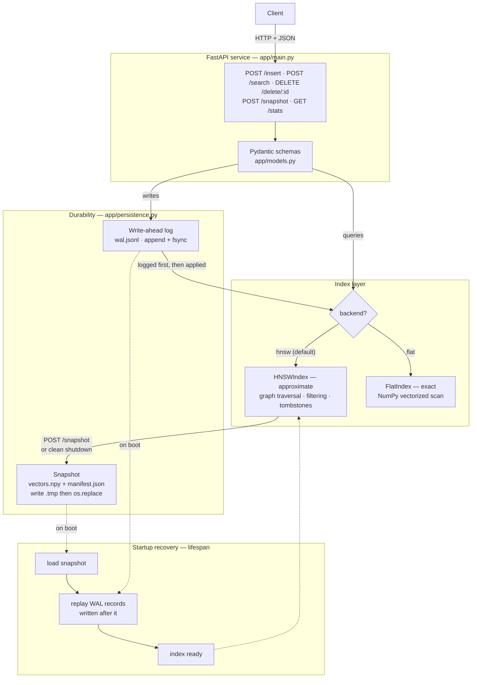

# nanovec

A persistent, filterable vector database built from scratch in Python: two
independent approximate indexes — an HNSW graph and an IVF + Product
Quantization index — plus metadata filtering, tombstone deletes, a write-ahead
log and snapshot durability layer, and a brute-force exact index kept alongside
as ground truth, all behind a FastAPI service.

The two approximate indexes are deliberate: HNSW trades build time for query
speed at full precision, IVF+PQ trades accuracy for a 32× smaller footprint.
They fail for different reasons, which is the point of implementing both.

## Why

I wanted to understand what FAISS, Milvus and Pinecone are actually doing, so
this implements the internals rather than calling a library. Everything here is
written from the papers and from first principles: the HNSW layer structure, the
Algorithm 4 diversity heuristic, the undirected-edge maintenance that keeps the
graph navigable, and the WAL-before-apply ordering that makes an acknowledged
write survive a crash.

The exact index runs in parallel with the approximate one, so recall is measured
against ground truth rather than assumed. The interesting output of a project
like this is not the code — it's the diagnostics. See
[Engineering notes](#engineering-notes).

## Current capabilities

- **`HNSWIndex`** (`app/hnsw.py`) — multi-layer navigable small world graph:
  skip-list style level assignment, greedy descent through sparse upper layers,
  wide `ef` search at layer 0, neighbour selection via the paper's diversity
  heuristic with `keepPrunedConnections` top-up, and undirected edge maintenance
  during pruning.
- **`IVFPQIndex`** (`app/ivfpq.py`) — inverted file index with product
  quantization: k-means++ coarse quantizer partitioning the space into `nlist`
  Voronoi cells, residual product quantization (`m` subspaces, one 256-entry
  codebook each), and asymmetric distance computation via per-cell `m × 256`
  lookup tables. Supports metadata filtering and tombstone deletes, and reports
  its own memory accounting split into per-vector and fixed costs.
- **Metadata filtering** — `pre` (filter during traversal) and `post` (filter
  after search), exposing the real filtered-ANN trade-off.
- **Tombstone deletes** — deleted nodes stay in the graph so traversal through
  them still works.
- **Durability** (`app/persistence.py`) — fsync'd write-ahead log, atomic
  snapshots, and recovery by snapshot load plus WAL replay.
- **`FlatIndex`** (`app/index.py`) — brute-force exact search, cosine and L2,
  NumPy-vectorized. The correctness ground truth, and reachable at runtime for
  exact-vs-approximate comparison over identical data.
- **FastAPI service** (`app/main.py`) — five endpoints, HNSW as the default
  query backend, index recovered from disk on startup via lifespan.
- **43 tests** covering recall against the flat baseline, graph edge symmetry,
  filtering semantics, delete behaviour, persistence including torn-record and
  idempotent-replay cases, and IVF+PQ recall, compression and memory accounting.
- **Diagnostics** — an ef/recall/latency sweep, a graph connectivity checker, a
  three-way index comparison, and a PQ compression/recall trade-off sweep.

## Architecture



**Write path:** the request is validated, appended to the WAL and fsync'd, and
only then applied to the in-memory index. **Recovery path:** load the latest
snapshot, then replay the WAL records that came after it.

**Search path through HNSW:** enter at the top layer, greedily walk to the
closest node at each level with `ef=1`, then run a wide best-first search at
layer 0 with the caller's `ef` budget and return the top `k`.

## Quickstart

```bash
git clone https://github.com/PPaul14/nanovec.git
cd nanovec

python -m venv venv
venv\Scripts\activate          # Windows
# source venv/bin/activate     # macOS / Linux

pip install -r requirements.txt
uvicorn app.main:app --reload
```

Interactive API docs: <http://127.0.0.1:8000/docs>

Run the tests and diagnostics:

```bash
venv/Scripts/python.exe -m pytest tests/ -v
venv/Scripts/python.exe -m benchmarks.ef_curve          # HNSW recall vs ef
venv/Scripts/python.exe -m benchmarks.connectivity      # HNSW graph health
venv/Scripts/python.exe -m benchmarks.compare_indexes   # Flat vs HNSW vs IVF+PQ
venv/Scripts/python.exe -m benchmarks.pq_tradeoff       # PQ recall vs compression
```

State persists to `data/` (`vectors.npy`, `manifest.json`, `wal.jsonl`).

## API reference

The service is configured for `DIM = 128`; vectors are abbreviated in the
examples below.

### `POST /insert`

```json
{
  "id": "doc_1",
  "vector": [0.12, -0.44, 0.98],
  "metadata": { "category": "shoes", "in_stock": true }
}
```

```json
{ "status": "ok", "id": "doc_1", "detail": null }
```

`400` if the vector dimension is not 128. `409` if the id already exists and is
not tombstoned. The record is written to the WAL and fsync'd before it is
applied in memory.

### `POST /search`

| Field | Type | Default | Meaning |
|---|---|---|---|
| `vector` | `float[128]` | required | Query vector |
| `k` | `int ≥ 1` | `5` | Number of results |
| `metric` | `string` | `"cosine"` | `"cosine"` or `"l2"` (flat backend) |
| `backend` | `"hnsw"` \| `"flat"` | `"hnsw"` | Approximate graph search, or exact scan |
| `ef` | `int ≥ 1` \| `null` | `null` | HNSW search breadth; `null` uses the index default |
| `filter` | `object` \| `null` | `null` | Exact-match metadata filter, conjunctive across keys |
| `filter_mode` | `"pre"` \| `"post"` | `"pre"` | Filter during traversal, or after search |

```json
{
  "vector": [0.10, -0.40, 0.95],
  "k": 3,
  "backend": "hnsw",
  "ef": 100,
  "filter": { "category": "shoes", "in_stock": true },
  "filter_mode": "pre"
}
```

```json
[
  { "id": "doc_1", "score": 0.9812, "metadata": { "category": "shoes", "in_stock": true } },
  { "id": "doc_7", "score": 0.9433, "metadata": { "category": "shoes", "in_stock": true } },
  { "id": "doc_3", "score": 0.9120, "metadata": { "category": "shoes", "in_stock": true } }
]
```

`score` is cosine similarity for `cosine` (higher is closer) and L2 distance for
`l2` (lower is closer). Tombstoned ids never appear. With `filter_mode: "post"`
the array may contain fewer than `k` entries — see [Filtering](#filtering).

### `DELETE /delete/{id}`

```json
{ "status": "ok", "id": "doc_1", "detail": null }
```

`404` if the id is unknown or already tombstoned. This is a soft delete: the
node remains in the graph as a traversal waypoint and is excluded from results.

### `POST /snapshot`

```json
{ "status": "ok", "id": null, "detail": "snapshot written to data" }
```

Writes a full point-in-time snapshot, then truncates the WAL. The snapshot is
made durable *before* the log is dropped.

### `GET /stats`

```json
{
  "live_vectors": 42,
  "tombstoned": 3,
  "dim": 128,
  "max_level": 2,
  "entry_point": "doc_17",
  "wal_bytes": 10432
}
```

## Durability

The index lives entirely in RAM, and rebuilding the graph from scratch is
expensive — every insert runs a full `ef_construction` search. So state is made
durable two ways, the same shape as Postgres checkpoints + WAL or Redis RDB +
AOF.

### Write-ahead log

Every mutation is appended to `data/wal.jsonl` and **fsync'd before it is
applied in memory**. The ordering is the entire guarantee. Apply-then-log would
leave a window where the client has been told the write succeeded but a crash
erases it; log-then-apply means the worst case is a logged record that was never
applied, which replay fixes.

The fsync matters as much as the ordering. Without it the write sits in the OS
page cache and a power loss silently drops it — that would be a write-behind log
that usually works, not a WAL.

### Snapshots

`save_snapshot` dumps the whole index: vectors as `vectors.npy` (float32 binary,
roughly 5× smaller than JSON and free of decimal round-tripping), and the graph,
metadata, levels and tombstones as `manifest.json` (human-readable, which makes
debugging connectivity far easier).

Both files are written to `.tmp` and then `os.replace`d, which is atomic on
POSIX and Windows. **A crash mid-write leaves the previous snapshot intact**
rather than a half-written unusable one.

### Recovery

On startup, `recover()` loads the latest snapshot and replays the WAL records
written after it. Two properties make this safe:

- **Replay is idempotent.** A snapshot may already contain a record the WAL also
  holds, so applying it twice must be harmless.
- **A torn final record stops replay cleanly.** A crash mid-append leaves an
  incomplete last line; that record never completed, so the client was never told
  it succeeded, and halting there is the correct behaviour rather than a
  corruption.

### Reproducing the crash test manually

Both tests below use a hard kill. **Do not use Ctrl+C** — a graceful shutdown
runs the lifespan handler, which takes a snapshot and truncates the WAL, and
that would defeat the second test entirely.

**Test 1 — snapshot survives a crash.**

```bash
uvicorn app.main:app                       # terminal 1

# terminal 2
curl -X POST localhost:8000/insert -H "Content-Type: application/json" \
     -d '{"id":"survivor","vector":[0.1, ... 128 floats]}'
curl -X POST localhost:8000/snapshot

# hard-kill the server (Windows; get the PID from netstat -ano | findstr :8000)
taskkill /F /PID <pid>
#   macOS / Linux: kill -9 <pid>

uvicorn app.main:app                       # restart
curl localhost:8000/stats                  # live_vectors includes "survivor"
```

**Test 2 — WAL replay recovers an unsnapshotted write.**

```bash
uvicorn app.main:app

curl -X POST localhost:8000/insert -H "Content-Type: application/json" \
     -d '{"id":"unsnapshotted","vector":[0.1, ... 128 floats]}'
# NO /snapshot call this time

taskkill /F /PID <pid>                     # hard kill again

uvicorn app.main:app
curl localhost:8000/stats                  # live_vectors still counts it
```

In test 2 the vector exists only in `data/wal.jsonl` at kill time. Recovery
replays it on top of whatever snapshot was on disk. The equivalent paths are
covered automatically by `tests/test_persistence.py`, including the torn-record
and idempotency cases.

## Filtering

Filtered ANN search has a genuine trade-off, and both sides of it are
implemented rather than one being picked silently.

**`filter_mode: "pre"`** applies the filter *during* graph traversal: a
non-matching node never enters the result set. It reliably returns `k` results
even under a highly selective filter, and costs more per query.

**`filter_mode: "post"`** searches normally, then drops non-matching results. It
is cheaper, but it can return fewer than `k` — or nothing at all.

The failure mode is concrete. Ask for the top 5 `"in_stock": true` items when
none of the 50 nearest neighbours are in stock: post-filtering searches, gets 50
out-of-stock neighbours, filters them all away, and returns an empty list even
though matching vectors exist further out. Pre-filtering keeps exploring until
it has 5 matches. (`post` oversamples to `max(ef, k * 10)` to make this less
likely, which shrinks the window without closing it.)

### Traversal must pass through non-matching nodes

The important implementation detail: under pre-filtering, the search still walks
*through* nodes that fail the filter. They are simply never admitted to the
result set.

Refusing to traverse them would be the obvious optimisation and it would be a
serious bug — it disconnects the graph along filter boundaries and reproduces
exactly the fragmentation failure from Week 2, where search gets stranded in
whichever region it started in. Non-matching nodes are still the bridges.

The early-termination check is also conditioned on the result set actually being
full, because under a selective filter it can stay below `ef` for a long stretch
and the search must keep exploring rather than bail out.

### Known cost

Filter matching is a full metadata scan, **O(N) per query**, on every filtered
search. Real systems maintain an inverted index (value → set of ids) to make
this sublinear. This is a known cost, not an oversight. Its impact is **not yet
measured** — neither benchmark exercises filtering.

## IVF + Product Quantization

HNSW attacks **time**: it avoids scanning all N vectors, but still stores every
vector at full precision. At 1M × 128-dim that is ~512 MB of raw float32 before
a single edge. IVF+PQ attacks **memory** instead, and the two techniques are
composed.

### IVF — scan fewer vectors

k-means partitions the space into `nlist` Voronoi cells. Every vector is
assigned to its nearest centroid and stored in that cell's inverted list. A
query computes its distance to the `nlist` centroids, then scans only the
`nprobe` nearest cells rather than all N vectors.

The coarse quantizer is trained with **k-means++** seeding. Uniform random
seeding lets two centroids land in the same cluster, and Lloyd's iterations
cannot recover — no centroid can cross the empty space between well-separated
clusters, so one ends up stranded midway between two real ones. Sampling each
new centroid with probability proportional to D(x)², the squared distance to the
nearest already-chosen centroid, biases selection toward whatever region is
currently covered worst.

### PQ — store each vector in m bytes

Split each `dim`-dimensional vector into `m` sub-vectors of length `dim/m`. Each
subspace gets its own 256-entry codebook, learned by k-means over that slice, so
a sub-vector is replaced by a single byte naming its nearest codebook entry. A
64-dim float32 vector — 256 bytes — becomes `m=8` bytes, a 32× reduction.

### Residual encoding

PQ encodes `vector - centroid`, not the vector itself. Residuals are far more
tightly distributed than raw vectors, so a fixed 256-entry codebook describes
them much more accurately. This is most of the gap between plain PQ and IVFADC,
and it is why the lookup tables have to be rebuilt per probed cell — the
residual is relative to *that* cell's centroid.

### Asymmetric Distance Computation

At query time the query is **never quantized**. For each subspace, precompute
the distance from the query's sub-vector to all 256 codebook entries, giving an
`m × 256` table. The distance to any stored vector is then `m` table lookups and
a sum — no decompression, no full-precision arithmetic.

Keeping one side exact is where "asymmetric" comes from, and it is measurably
more accurate than quantizing both sides, since it avoids adding the query's own
quantization error to every comparison.

### Why both indexes exist here

| | HNSW | IVF+PQ |
|---|---|---|
| Optimises | Query time | Memory |
| Storage | Full precision + graph | `m` bytes per vector |
| Loses recall by | Not visiting every node | Storing lossy reconstructions |
| Needs training | No | **Yes** — codebooks must be fitted first |

The two approximations are different in kind. HNSW can in principle reach recall
1.000 with a large enough `ef`, because the vectors it compares are exact; PQ
cannot, at any `nprobe`, because the information was discarded at encode time.
Their failure modes do not overlap, which is the whole reason to build both.

## Benchmarks

Measured on n=1000, dim=32, cosine, `M=16`, `M0=32`, `ef_construction=200`,
30 queries, Recall@10 against `FlatIndex` as ground truth. Single-threaded
CPython 3.14 on Windows. No filtering in these runs.

### Uniform random

| ef | Recall@10 | p50 (ms) | QPS |
|----:|----:|----:|----:|
| 10 | 1.000 | 1.351 | 714.9 |
| 25 | 1.000 | 2.200 | 472.2 |
| 50 | 1.000 | 2.903 | 282.9 |
| 100 | 1.000 | 3.620 | 257.5 |
| 200 | 1.000 | 5.608 | 159.0 |
| 400 | 1.000 | 5.935 | 152.6 |
| **flat (exact)** | **1.000** | **0.080** | **11385.8** |

### Clustered (sigma = 0.05, 10 clusters × 100)

| ef | Recall@10 | p50 (ms) | QPS |
|----:|----:|----:|----:|
| 10 | 1.000 | 0.511 | 1678.9 |
| 25 | 1.000 | 0.591 | 1369.1 |
| 50 | 1.000 | 0.644 | 1142.7 |
| 100 | 1.000 | 0.799 | 1195.4 |
| 200 | 1.000 | 1.437 | 608.8 |
| 400 | 1.000 | 2.568 | 374.1 |
| **flat (exact)** | **1.000** | **0.072** | **12865.3** |

### Graph connectivity (clustered, n=1000)

| Metric | Value |
|---|---|
| Reachable from entry point | 1000 / 1000 |
| Connected components | 1 |
| Layer-0 degree min / mean / max | 8 / 27.9 / 32 |
| Nodes with 0 edges / < 4 edges | 0 / 0 |
| Asymmetric edges | 0 |
| Duplicate edges | 0 |
| Cross-cluster edges | 402 / 27874 (1.44%) |
| Layer sizes | L0: 1000 nodes / 27874 edges · L1: 70 / 994 · L2: 7 / 42 |

Layer-0 figures are deterministic across runs. Upper-layer node counts vary
because level assignment is a random draw the benchmark does not seed — only the
layer-0 numbers are stable.

### Three-way comparison: Flat vs HNSW vs IVF+PQ

n=2000, dim=64, 20 clusters (sigma=0.06), 30 queries, k=10, cosine. IVF+PQ at
`nlist=32`, `m=8`. Recall@10 against `FlatIndex` as ground truth.

| Index | Recall@10 | p50 (ms) | Build (s) | Memory (KB) | Per-vector compression |
|---|---:|---:|---:|---:|---:|
| Flat (exact) | 1.000 | 0.733 | 0.03 | 500.0 | — |
| HNSW (ef=25) | 1.000 | 3.060 | 81.33 | 950.5 | — |
| HNSW (ef=100) | 1.000 | 4.175 | 81.33 | 950.5 | — |
| IVF+PQ (nprobe=1) | 0.613 | 0.823 | 6.01 | 87.6 | 32× |
| IVF+PQ (nprobe=4) | 0.627 | 2.467 | 6.01 | 87.6 | 32× |
| IVF+PQ (nprobe=16) | 0.627 | 9.221 | 6.01 | 87.6 | 32× |

IVF+PQ memory breaks down as 15.6 KB of codes (8 bytes/vector), 64.0 KB of
codebooks and 8.0 KB of coarse centroids. **Fixed costs dominate at this N** —
codebooks alone are 73% of the total. That share falls toward zero as N grows,
which is why the per-vector ratio is reported separately from the headline
number: folding a constant into a single ratio would flatter the result at 1k
and understate it at 1M.

### What limits IVF+PQ recall

This is the most interesting Week 4 result, and it is not the one the table
suggests at a glance.

**Recall is identical from nprobe=4 through nprobe=32.** `nlist=32`, so
`nprobe=32` probes *every* cell — no vector is skipped for coverage reasons at
all — and recall still sits at 0.627. Scanning more of the index buys nothing.

So the ceiling is not cell coverage. It is PQ quantization error. Sweeping `m`
while holding everything else fixed confirms it (`benchmarks/pq_tradeoff.py`):

| m | subvector dim | compression | nprobe=1 | nprobe=32 (all cells) |
|---:|---:|---:|---:|---:|
| 4 | 16d | 64× | 0.497 | 0.507 |
| 8 | 8d | 32× | 0.613 | 0.627 |
| 16 | 4d | 16× | 0.757 | 0.793 |
| 32 | 2d | 8× | 0.893 | 0.957 |

Read down the columns: recall climbs steadily with `m`. Read across the rows:
probing every cell instead of one adds between 0.010 and 0.064. The subspace
count dominates; the probe count barely registers.

**The curve is the result, not any single row.** Raising `m` to 32 buys recall
0.957 — but at 8× compression instead of 32×, which discards most of the reason
to choose IVF+PQ over HNSW in the first place. There is no setting here that is
simply "better"; there is a frontier, and picking a point on it is an
application decision about how much memory a percentage of recall is worth.

**These numbers are provisional.** The codebooks are under-trained at this
scale: 2000 training vectors across 8 subspaces against 256 centroids each is
roughly **8 training points per centroid**. FAISS wants orders of magnitude more
for `ksub=256`. Expect all of these recall figures to improve at the Week 5
scale-up, and treat the shape of the curve as more trustworthy than its absolute
height.

**On k-means++:** switching the coarse quantizer from random to k-means++
seeding measurably improved it — visible at `nprobe=1`, where better-spread
cells mean the single nearest cell captures more true neighbours. It did **not**
move the headline number, and that is consistent rather than contradictory: the
coarse quantizer stops mattering above `nprobe=4`, so an improvement to it has
nowhere to show up once enough cells are being probed.

### The honest caveat

Two things these tables do **not** show.

**Brute force still beats HNSW at this scale, by roughly 5–100×.** That is the
expected result, not a defect. At n=1000 the flat index is one
`(1000, 32) @ (32,)` matrix multiply — a single vectorized C loop over 32k
floats — while HNSW pays Python interpreter overhead per node visited during
graph traversal. The graph's asymptotic advantage (O(log n) nodes visited versus
O(n)) does not pay for that constant factor until the scan itself gets expensive.

**Recall@10 is 1.000 at every ef value, on both distributions.** The whole point
of an `ef` parameter is to trade recall against latency, and a column of
identical 1.000s means n=1000 is too small for approximation error to appear at
all — the graph search is finding the exact answer every time. No trade-off
curve exists in this data. These tables should be read as "this dataset is too
easy to distinguish the two indexes on quality," not as "HNSW achieves 100%
recall."

What they do establish is that latency responds to the `ef` budget, which is
itself the signature of a healthy graph — see below for what it looks like when
it doesn't.

Both effects resolve at scale. The real recall/latency curve and the flat/HNSW
crossover get measured at 100k+ vectors in Week 5. Until then, treat both "HNSW
is faster" and "HNSW is accurate" as unproven by this repository.

## Engineering notes

The most useful thing this project produced was a graph diagnostic, and the
reason is that **recall never caught either of these bugs**. Both were found by
asserting on structure, not on output quality.

### Week 2 — the graph was fragmented

| Metric (clustered, n=1000) | Before | After |
|---|---:|---:|
| Recall@10 | 0.547 | **1.000** |
| Layer-0 nodes reachable from entry point | 100 / 1000 | **1000 / 1000** |
| Asymmetric layer-0 edges | 11930 | **0** |
| Connected components | many | **1** |

HNSW scored a perfect 1.000 Recall@10 on uniform random vectors but only 0.547
on clustered data, and it stayed flat across ef = 10 → 400. Latency barely grew
with ef either.

That combination is diagnostic. If recall were merely *low*, the search would be
too shallow and raising ef would fix it. Recall that is flat **and** latency that
ignores ef means the search is exhausting its reachable set long before it spends
its ef budget — it runs out of graph, not out of budget. That points at
construction, not tuning.

So I wrote `benchmarks/connectivity.py` to test it directly: BFS from the entry
point over layer-0 edges, count components, check edge symmetry. It reported
**only 100 of 1000 nodes reachable**, and **11930 layer-0 edges asymmetric** —
about 37% of them.

Root cause: when a new node A connected to neighbour B, the reverse edge B→A was
added and then immediately pruned away — A was far, so the diversity heuristic
dropped it — leaving a one-way edge A→B. Because the first inserted cluster had
nothing to link outward to, every cross-cluster edge ended up pointing *into*
it. Search could enter a region and never leave.

Fix: maintain undirected edges. When B drops A during pruning, A also drops B.

### Week 3 — the fix was defeated by mutation during iteration

The undirected-edge repair was correct in intent and undermined by aliasing. The
new node's neighbour list was published by reference and then iterated *while
the repair mutated it*:

```python
self.neighbors[l][id] = selected   # same list object
for n_id in selected:              # iterating the live list
    ...
    for d in dropped:
        d_list.remove(n_id)        # can remove from `selected` mid-loop
```

When neighbour B pruned the new node A away, the repair called `.remove()` on
A's own list — the very list the `for` loop was walking. Removing the current
element shifts the remainder left, so **the next neighbour was silently
skipped** and never received its reverse edge. The repair for one-way edges was
creating one-way edges.

Symptom: `asymmetric edges: 2398` in the connectivity diagnostic, **while every
existing test passed**. Recall was 1.000. At n=1000 the graph stays dense enough
(mean degree ~28, single component) that search succeeds despite thousands of
broken edges, so the suite was structurally blind to it.

Fix: store and iterate a copy of the neighbour list — `list(selected)` in both
places. Asymmetric edges 2398 → 0.

**The regression test was verified to fail, not assumed to.**
`test_layer0_edges_are_symmetric` builds a 500-vector clustered index and
asserts every layer-0 edge `A→B` has a matching `B→A`. Run against the reverted
code it reports **495 of 14,669 layer-0 edges one-way** and fails; against the
fixed code, 0. It also asserts the graph is non-empty first, so it cannot pass
vacuously. A regression test nobody has seen fail is a guess.

### The lesson

For a data structure, assert on **structural invariants** — symmetry,
reachability, degree bounds — not only on end-to-end quality metrics. Quality
metrics degrade gracefully, which means they hide structural damage right up
until the scale at which they suddenly don't.

## Known limitations

Stated plainly rather than discovered later.

- **No compaction of tombstones.** Deleted nodes stay in `data` and in the graph
  forever. Memory never shrinks after a delete, and search does wasted distance
  work on dead nodes. A delete-heavy workload degrades until restart.
- **O(N) filter matching.** Every filtered query does a full metadata scan.
  Real systems keep an inverted index. Impact not yet measured.
- **No concurrency control.** The index is plain, unsynchronised Python objects
  with no locking, and FastAPI can interleave requests. **A single uvicorn worker
  (the default) is required.** Multiple workers would need either a lock or a
  single-writer process; running them today would corrupt the graph.
- **Nodes promoted above the current max level get no neighbour entries at those
  top layers.** Insert only connects from `min(level, max_level)` downward, so a
  node drawing a level above the current maximum becomes the entry point at
  layers where it has no adjacency. Harmless in practice — descending through an
  empty layer just returns the entry point unchanged — but the node is silently
  absent from layers it was promoted to.
- **Filtering is exact-match only**, conjunctive across keys. No ranges, no `OR`,
  no negation.
- **The flat index is derived state.** Only HNSW is snapshotted; `FlatIndex` is
  rebuilt from it on boot. Cheap, but it means the two can only ever agree.
- **IVF+PQ is not wired into the API.** It requires a training step before it
  will accept a single write — the codebooks *are* the compression, and they
  have to be fitted to the data distribution first. HNSW accepts writes from
  empty. There is no training endpoint, so IVF+PQ is reachable only through the
  tests and benchmarks, not over HTTP.
- **IVF+PQ supports only `nbits=8`** (256-entry codebooks). Other codebook sizes
  are rejected at construction.
- **PQ codebooks are under-trained at benchmark scale** — roughly 8 training
  points per centroid. Recall figures for IVF+PQ are provisional until Week 5.
- **Neither IVF+PQ nor its state is persisted.** The WAL and snapshot layer
  covers HNSW only.
- **Benchmarks are n=1000 and n=2000**, too small to demonstrate the properties
  either approximate index exists for. See the caveats above.

## Roadmap

- [x] **Week 1** — flat index (cosine + L2) and FastAPI CRUD service
- [x] **Week 2** — HNSW from scratch, Algorithm 4 heuristic, recall validation
      against the flat baseline, ef sweep and connectivity diagnostics
- [x] **Week 3** — persistence (snapshot + WAL), metadata filtering with pre/post
      modes, tombstone deletes, HNSW wired through the API as the default backend
- [x] **Week 4** — IVF + Product Quantization: k-means++ coarse quantizer,
      residual encoding, ADC lookup tables, three-way index comparison, and the
      PQ compression/recall trade-off sweep
- [ ] **Week 5** — benchmarking at 100k+ vectors: measure the real recall/latency
      curve across ef, and locate the flat/HNSW crossover
- [ ] **Week 6** — Docker, architecture diagrams, documentation

## License

MIT — see [LICENSE](LICENSE). Copyright (c) 2026 Priyanshi Paul.

## References

- Malkov, Y. A., & Yashunin, D. A. (2016). *Efficient and robust approximate
  nearest neighbor search using Hierarchical Navigable Small World graphs.*
  [arXiv:1603.09320](https://arxiv.org/abs/1603.09320)
- Jégou, H., Douze, M., & Schmid, C. (2011). *Product Quantization for Nearest
  Neighbor Search.* IEEE TPAMI, 33(1), 117–128.
  [DOI:10.1109/TPAMI.2010.57](https://doi.org/10.1109/TPAMI.2010.57)
